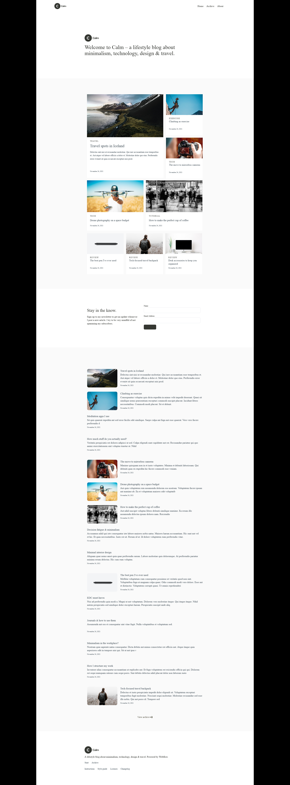

# 🎨 Верстка макетов из Figma

Этот проект включает верстку **макета**, созданного в Figma.  
Макеты выполнены с использованием технологий (HTML, CSS, Vue,Vite).  

---

## 🚀 Используемый стек

  

---

## 🖼️ Превью макетов

| Макет | Превью | Ссылка на код |
|-------|--------|---------------|
| Макет 1 |  | [🔗 Код](https://github.com/Shamitsu212/Figma_to_VUE/tree/main/my-vue-app) |

---
